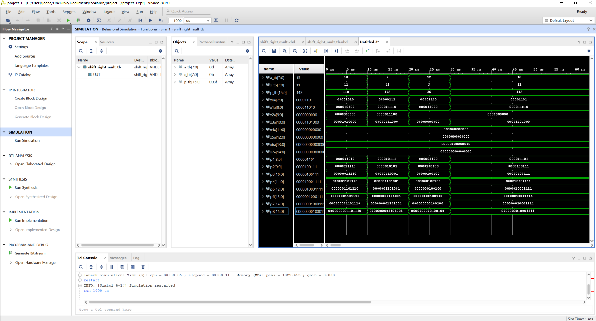
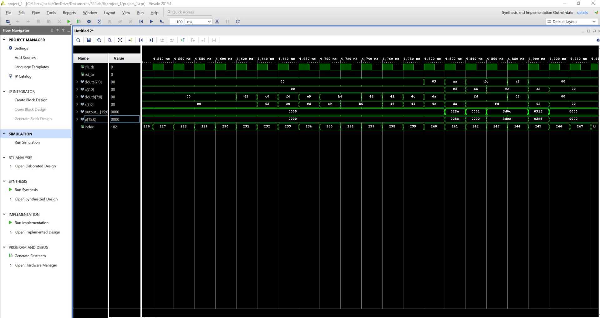
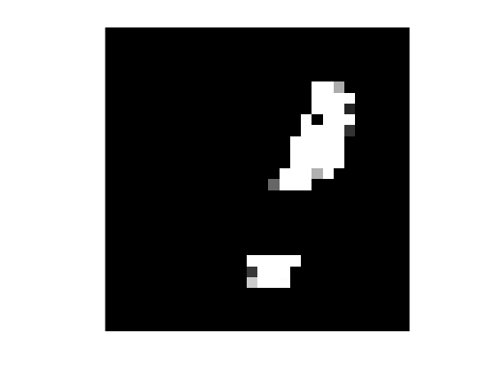
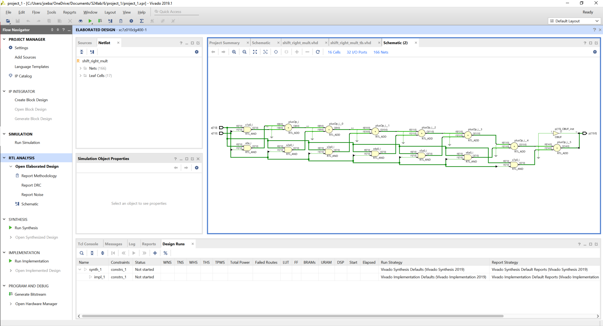
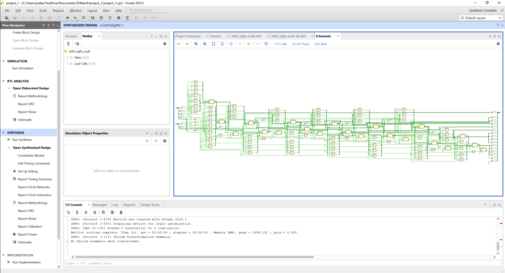
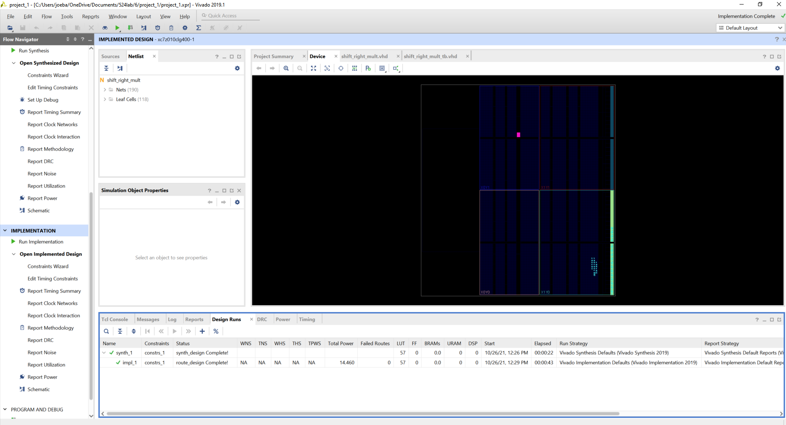
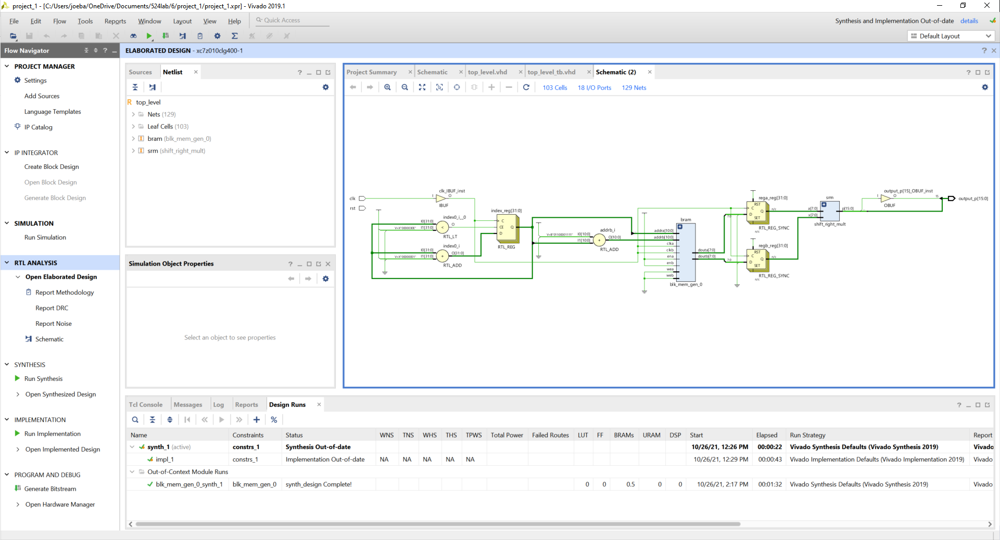
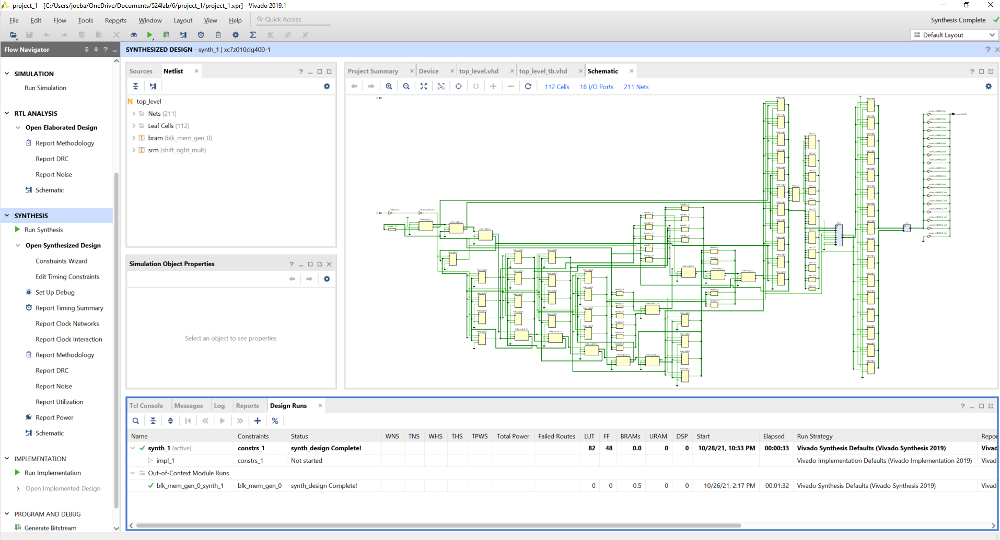
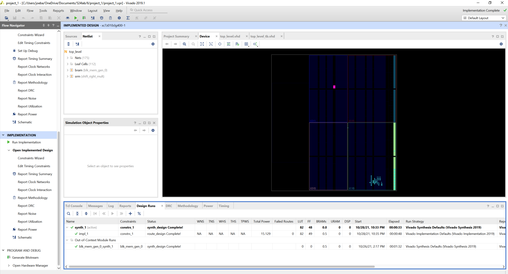

# CSUN ECE 524L Fall 2021
## Lab 5 - Arithmetic

**Report Created by:**
- Group 2 
- Joseph Barchanowicz
- Morris Blaustein
- Karl Gacia

**Submission date:** 11/02/2021

## Introduction
Our goal for this lab is to be able to implement a digital computer arithmetic system and learn how to utilize block RAM to perform parallel tasks. For this lab, we will be implementing an 8-bit unsigned multipier using the right shift algorithm arithmetic circuit that was covered in our lab. We will then use the multiplier to multiply two MNIST images read simultaneously from a True-Duel port BRAM. 

The Modified National Institute of Standards and Technology Database (MNIST) is a large database of handwritten digits that is commonly used for training various image processing system. 


Every image found in MNIST database has an image size of 28 x 28 pixels. The pixel values are recorded in a 784 1D array (28 x 28 = 784) where element 0 corresponds to pixel (0,0) and element 783 corresponds to pixel (28,28). 

## Pre-Lab
Not applicable for this lab.

## Procedure
**Task 1:** Design and implement an unsigned 8 bit shift right multiplier.  
Below is the code that we used to implement the unsigned 8 bit shift right multiplier.  

```VHDL
library IEEE;
use IEEE.STD_LOGIC_1164.ALL;
use IEEE.NUMERIC_STD.ALL;
use IEEE.STD_LOGIC_UNSIGNED.ALL;

entity shift_right_mult is
    Port ( a : in STD_LOGIC_VECTOR (7 downto 0);
           x : in STD_LOGIC_VECTOR (7 downto 0);
           p : out STD_LOGIC_VECTOR (15 downto 0));
end shift_right_mult;

architecture Behavioral of shift_right_mult is

signal x0a: std_logic_vector(7 downto 0);
signal x1a: std_logic_vector(8 downto 0);
signal x2a: std_logic_vector(9 downto 0);
signal x3a: std_logic_vector(10 downto 0);
signal x4a: std_logic_vector(11 downto 0);
signal x5a: std_logic_vector(12 downto 0);
signal x6a: std_logic_vector(13 downto 0);
signal x7a: std_logic_vector(14 downto 0);

signal p1: std_logic_vector(8 downto 0);
signal p2: std_logic_vector(9 downto 0);
signal p3: std_logic_vector(10 downto 0);
signal p4: std_logic_vector(11 downto 0);
signal p5: std_logic_vector(12 downto 0);
signal p6: std_logic_vector(13 downto 0);
signal p7: std_logic_vector(14 downto 0);
signal p8: std_logic_vector(15 downto 0);

begin

x0a <= (a AND (7 downto 0 => x(0)));
x1a <= (a AND (7 downto 0 => x(1))) & '0';
x2a <= (a AND (7 downto 0 => x(2))) & "00";
x3a <= (a AND (7 downto 0 => x(3))) & "000";
x4a <= (a AND (7 downto 0 => x(4))) & "0000";
x5a <= (a AND (7 downto 0 => x(5))) & "00000";
x6a <= (a AND (7 downto 0 => x(6))) & "000000";
x7a <= (a AND (7 downto 0 => x(7))) & "0000000";

p1 <= '0' & x0a;
p2 <= '0' & (p1 + x1a);
p3 <= '0' & (p2 + x2a);
p4 <= '0' & (p3 + x3a);
p5 <= '0' & (p4 + x4a);
p6 <= '0' & (p5 + x5a);
p7 <= '0' & (p6 + x6a);
p8 <= '0' & (p7 + x7a);

p <= p8;

end Behavioral;
```

**Task 2:** Create a Testbench to verify the functionality of the multiplier.  
Below is the code that we used to create a testbench to verify the functionality of the multiplier.  Figure 6.1 shows the output waveform to prove that our component is working correctly.  

```VHDL
library IEEE;
use IEEE.STD_LOGIC_1164.ALL;

entity shift_right_mult_tb is

end shift_right_mult_tb;

architecture Behavioral of shift_right_mult_tb is

component shift_right_mult is
    Port ( a : in STD_LOGIC_VECTOR (7 downto 0);
           x : in STD_LOGIC_VECTOR (7 downto 0);
           p : out STD_LOGIC_VECTOR (15 downto 0));
end component shift_right_mult;

signal a_tb: std_logic_vector (7 downto 0);
signal x_tb: std_logic_vector (7 downto 0);
signal p_tb: std_logic_vector (15 downto 0);

begin

UUT: shift_right_mult port map (a => a_tb, x => x_tb, p => p_tb);

process
begin
    a_tb <= "00001010";
    x_tb <= "00001011";
    wait for 10 ns;
    a_tb <= "00000111";
    x_tb <= "00001111";
    wait for 10 ns;
    a_tb <= "00001100";
    x_tb <= "00000011";
    wait for 10 ns;
    a_tb <= "00001101";
    x_tb <= "00001011";
wait;
end process;

end Behavioral;  
```
  
Figure 6.1 Waveform for the Shift Right Multiplier

**Task 3:** Create a component that uses a True Dual port RAM to read both images at the same time. Pixel data of images shall be multiplied by the shift right multiplier and the result should be returned in the output port.  

Below is the code used for the toplevel of this design.  The toplevel instanciates both the BRAM and Shift Right Multiplier components. 

```VHDL
library IEEE;
use IEEE.STD_LOGIC_1164.ALL;
use IEEE.NUMERIC_STD.ALL;

entity top_level is
 Port (  clk     : in std_logic;
         rst     : in std_logic;
         output_p : out STD_LOGIC_VECTOR (15 downto 0));
end top_level;

architecture Behavioral of top_level is
COMPONENT blk_mem_gen_0
  PORT (
    clka : IN STD_LOGIC;
    ena : IN STD_LOGIC;
    wea : IN STD_LOGIC_VECTOR(0 DOWNTO 0);
    addra : IN STD_LOGIC_VECTOR(10 DOWNTO 0);
    dina : IN STD_LOGIC_VECTOR(7 DOWNTO 0);
    douta : OUT STD_LOGIC_VECTOR(7 DOWNTO 0);
    clkb : IN STD_LOGIC;
    enb : IN STD_LOGIC;
    web : IN STD_LOGIC_VECTOR(0 DOWNTO 0);
    addrb : IN STD_LOGIC_VECTOR(10 DOWNTO 0);
    dinb : IN STD_LOGIC_VECTOR(7 DOWNTO 0);
    doutb : OUT STD_LOGIC_VECTOR(7 DOWNTO 0)
  );
END COMPONENT;

component shift_right_mult is
    Port ( a : in STD_LOGIC_VECTOR (7 downto 0);
           x : in STD_LOGIC_VECTOR (7 downto 0);
           p : out STD_LOGIC_VECTOR (15 downto 0));
end component;

signal clka, ena, clkb,  enb : STD_LOGIC;
signal wea, web : STD_LOGIC_VECTOR(0 DOWNTO 0);
signal dina, douta, dinb, doutb, a, x : STD_LOGIC_VECTOR(7 DOWNTO 0);
signal addra, addrb : STD_LOGIC_VECTOR(10 DOWNTO 0);
signal p : STD_LOGIC_VECTOR (15 downto 0);

signal index : integer := 0;
signal rega : integer := 0;
signal regb : integer := 0;

begin

bram : blk_mem_gen_0
  PORT MAP (
    clka => clk,
    ena => ena,
    wea => wea,
    addra => addra,
    dina => dina,
    douta => douta,
    clkb => clk,
    enb => enb,
    web => web,
    addrb => addrb,
    dinb => dinb,
    doutb => doutb
  );
  
ena <= '1';
enb <= '1';
wea <= "0";
web <= "0"; 

addra <= std_logic_vector(to_unsigned(index, addra'length));
addrb <= std_logic_vector(to_unsigned(783 + index, addrb'length));

srm: shift_right_mult 
    Port map( 
        a => a,
        x => x,
        p => p
    );

process(clk)
begin
if rising_edge(clk) then
    if index < 782 then
        index <= index+1;
    end if;
end if;
end process;

process(clk)
begin
    if rising_edge(clk) then
        rega <= to_integer(unsigned(douta));
        regb <= to_integer(unsigned(doutb));
    end if;
end process;

a <= std_logic_vector(to_unsigned(rega, a'length));
x <= std_logic_vector(to_unsigned(regb, x'length));

output_p <= p;

end Behavioral;
```

**Task 4:** Create a Testbench to verify the functionality of the multiplier. Save the result of the multiplier into a text file. Use Python or Matlab to draw the generated image.  

Below is the code for the testbench that was used to verify that the topleve correctly instanciated the BRAM and the shift right multiplier components. Figure 6.2 shows part of the output waveform of the toplevel to prove that our component is working correctly. 

```VHDL
library IEEE;
use IEEE.STD_LOGIC_1164.ALL;

entity top_level_tb is
--  Port ( );
end top_level_tb;

architecture Behavioral of top_level_tb is
component top_level is
 Port (  clk     : in std_logic;
         rst     : in std_logic;
         output_p : out STD_LOGIC_VECTOR (15 downto 0));
end component top_level;

signal clk_tb, rst_tb : std_logic;
signal output_p_tb : STD_LOGIC_VECTOR (15 downto 0);
file outfile : text open write_mode is "output_img.txt";

begin
UUT: top_level port map (clk => clk_tb, rst => rst_tb, output_p => output_p_tb);

process begin
clk_tb <= '1';
wait for 10ns;
clk_tb <= '0';
wait for 10ns;
end process;

process begin
rst_tb <= '1';
wait for 20ns;
rst_tb <= '0';
wait;
end process;

process
variable outline : line;
begin
write(outline,to_integer(unsigned(output_p_tb)));
writeline(outfile,outline);
wait for 20ns;
end process;

end Behavioral;
```
  
Figure 6.2 Waveform for the Toplevel

## Testing Strategy
The testing strategy for this lab is to first simulate both of the compenents using there testbench to see if we are getting the correct values.  We then save the result of the multiplier into a text file and used Matlab to draw the generated image to make sure that we are getting the correct outputs.   

## Results (Data)
  
Figure 6.3 Waveform for the Shift Right Multiplier

  
Figure 6.4 Waveform for the Toplevel

  
Figure 6.5 Output image After Multiplying Two Images

## FPGA Resources
**Task 5:** Provide FPGA resource utilization for your design.  
Below in figures 6.6 - 6.11 are the FPGA resource and utilization for both the shift right multiplier and the toplevel of our design.

  
Figure 6.6 RTL Schematic for Shift Right Multiplier

  
Figure 6.7 Syntesis for Shift Right Multiplier  

  
Figure 6.8 Implementation for Shift Right Multiplier

  
Figure 6.9 RTL Schematic for toplevel

  
Figure 6.10 Syntesis for toplevel

  
Figure 6.11 Implementation for toplevel

## Conclusion
By performing this lab, we were able to accomplish our goals of learning how to implement a digital computer arithmetic system and how to uzilize a block RAM to perform parallel task. For this lab, we were able to successfully design and implement an unsigned 8 bit shift right multiplier and a component that uses a True Dual Port RAM, which were both needed for this lab. After designing our circuit, we wrote our testbench to test our design. After analyzing the waveforms, we concluded that our designs functioned as they should. This was a pretty straight forward lab and the implemementation of both the BRAM and shift right multiplier components worked well.  It was interesting to see this work and it was the first time we have learned about MNST database. No problems were encountered for this lab.  


-------------
-------------  

# Is assignment ready for review? Yes
