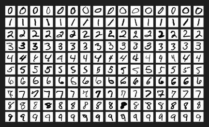
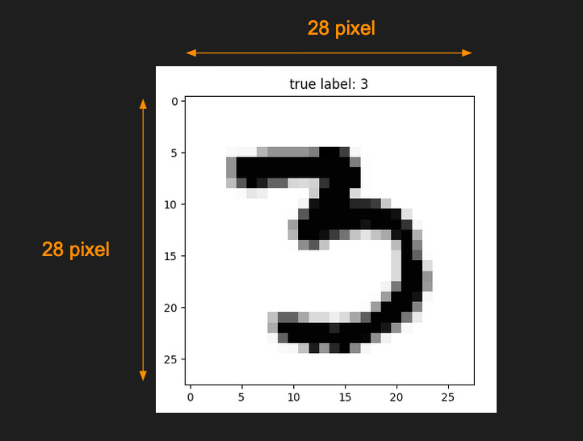
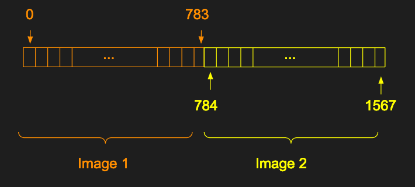
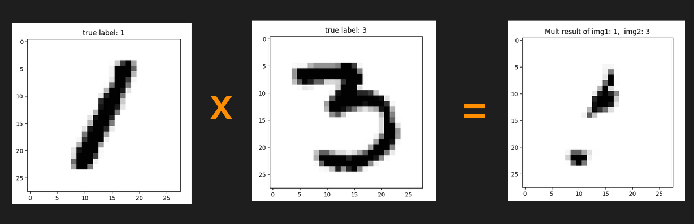
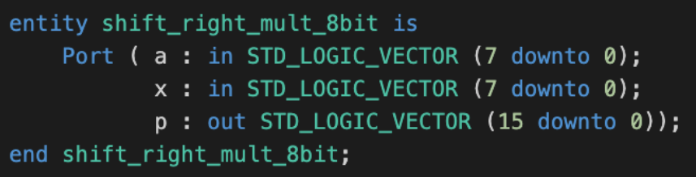
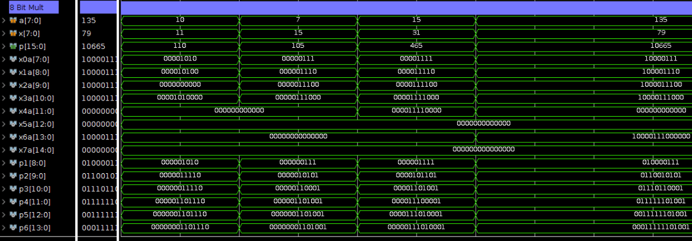
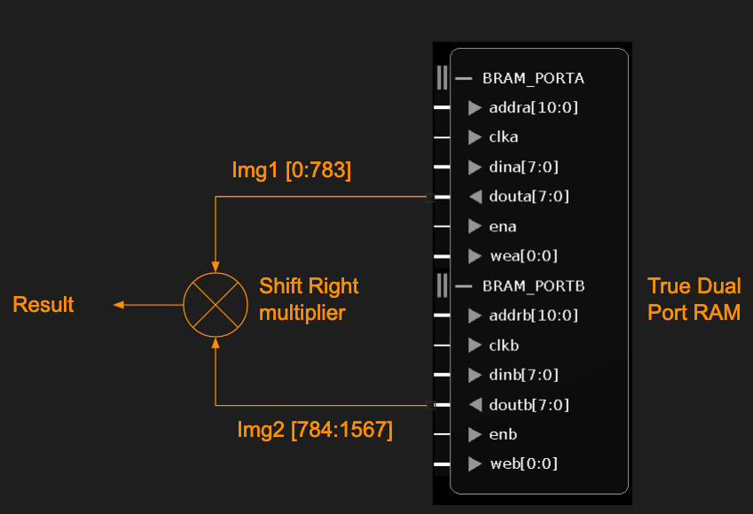
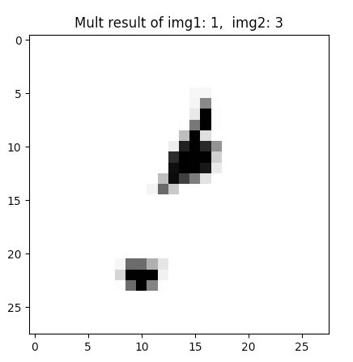

# ECE 524L Fall 2021
**California State University, Northridge**  
**Department of Electrical and Computer Engineering**  

# Lab 5 - Arithmetic

## Objective

After completing this lab, students will be able to:
- Implement a digital computer arithmetic system
- Utilize Block RAM to perform parallel tasks

## Requirements

The following material is required to complete the lab:
- Xilinx Vivado 2019.1

## Introduction

In this lab you are going to implement an 8-bit unsigned multiplier (Right shift algorithm) arithmetic circuits that is covered in the class. you will then use the multiplier to multiply two MNIST images read simultaneously from a True-Dual port BRAM. Write VHDL code to implement the circuit as well as simulation testbench to verify its functionality.

## About MNIST
The MNIST database (Modified National Institute of Standards and Technology database) is a large database of handwritten digits that is commonly used for training various image processing systems.



Each image is 28 x 28 pixel



Pixel values are recorded in a 784 1D array (784 = 28 x 28) where element 0 corresponds to pixel (0,0) and element 783 corresponds to pixel (28,28).

Use the provided Python script to generate the COE file.
Generated file will an array of 1D elements with the size of 2*784 = 1568 which is the pixel data of two images concatenated to each other as shown below:



Note: If you cannot use the Python code use the provided [COE file](./image_data_1_3.coe) from the instruction folder.

Use the following commands to setup a virtual environment to run the Python code:

Create virtual environment

```bash
$ python3 -m venv my-venv
```

Activate the virtual environment

```bash
$ source my-venv/bin/activate 
```
Note: the activation for windows might be different depending on which shell you use.
Determine the correct activation from the following source: https://docs.python.org/3/library/venv.html

Install required packages

```bash
$ pip install --upgrade pip
$ pip install mlxtend
$ pip install matplotlib
```

To run the python script use the following command
```bash
$ python3 path/to/python/file/mnist_img_draw.py
```
Note: change the path to your local location. For example `./instruction/mnist_img_draw.py`
Note: Do not commit the virtual environment folder to the git repo.


Image multiplication is used for superimposing two images.
```
img3(x, y) = img1(x, y) x img2(x,y)
```

Figure below shows the result of superimposing (multiplying) two MNIST images 



:point_right: **Task 1:** Design and implement an unsigned 8 bit shift right multiplier..
Ports:



:point_right: **Task 2:** Create a Testbench to verify the functionality of the multiplier.

The following is an example waveform:


:point_right: **Task 3:** Create a component that uses a True Dual port RAM to read both images at the same time. Pixel data of images shall be multiplied by the shift right multiplier and the result should be returned in the output port.



:point_right: **Task 4:** Create a Testbench to verify the functionality of the multiplier. Save the result of the multiplier into a text file. Use Python or Matlab to draw the generated image.
Example output result:



:point_right: **Task 5:** Provide FPGA resource utilization for your design.
